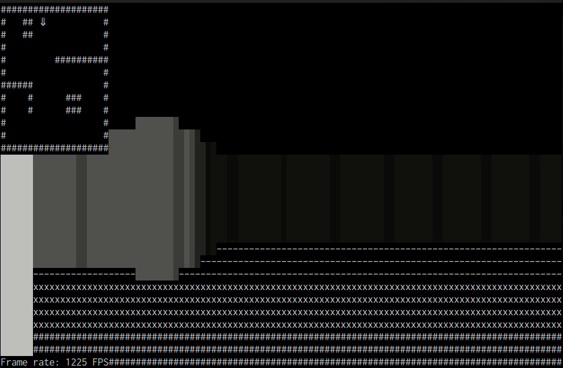
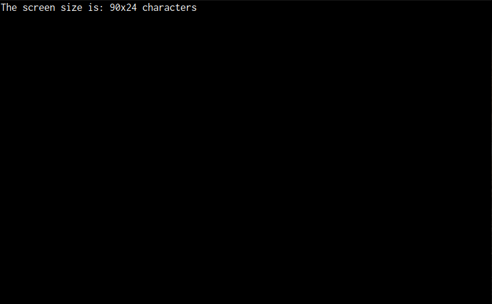
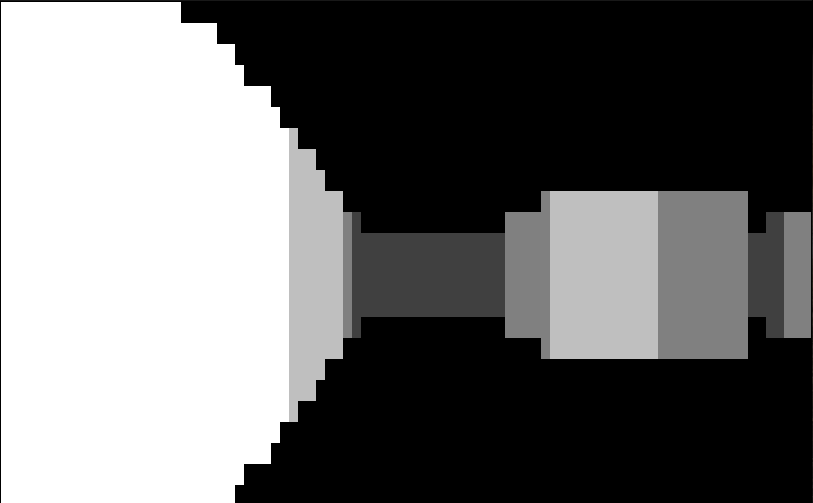
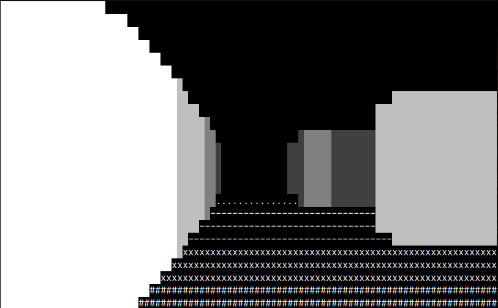
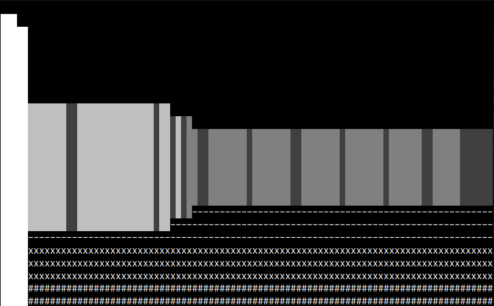
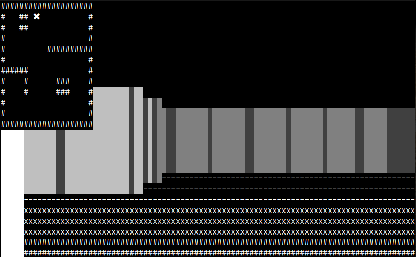
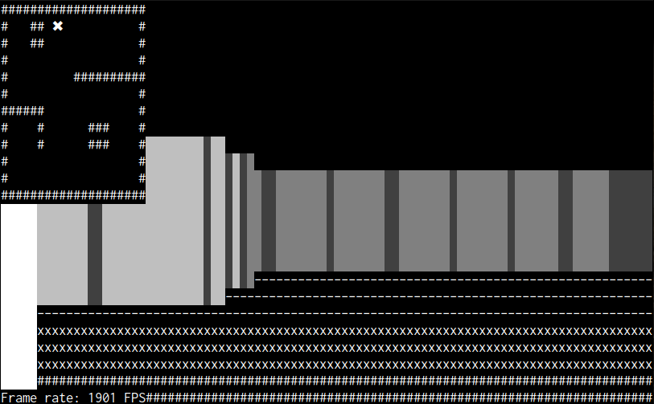
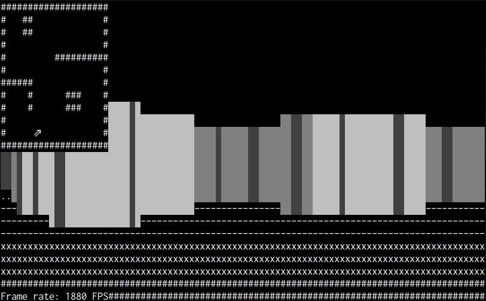
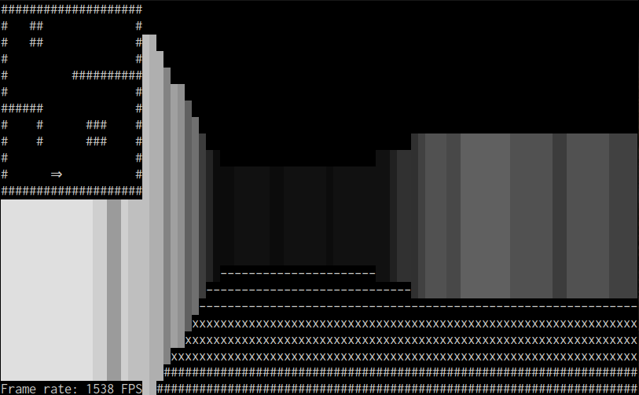

# Raycasting exercise solutions

This set of source files implements possible solutions for the raycasting exercise.



As usual with programming exercises, there is no such thing as "the solution" -- many options are possible.
These solutions are mine, and opinionated by my experience, taste and style.
Feel free to divert and disagree.

The goal is to learn from this coding exercise, so just consider my approach to the solutions as one of the many options out there.

## Build requirements

A compiler able to deal with C++20.
You might need a system-installed [{fmt} formatting library](https://github.com/fmtlib/fmt) if your standard library doesn't implement the `<format>` module/header.

For this simple setup I used [Cmake](https://cmake.org/) as a build system.
See build instructions below.
Your IDE might well be able to parse Cmake files to create a project.

I implemented my solutions using [ncurses](https://en.wikipedia.org/wiki/Ncurses), a terminal UI toolkit for POSIX-compatible systems.
It's been around for over 30 years now, I'm quite sure there's a version for your environment out there (e.g. you can simply use ncurses from Windows using WSL).
There are many bindings for ncurses to other programming languages too.

Another note on ncurses: we use the 'wide' variant of ncurses, the one that supports Unicode.
This is not strictly required, but being able to use Unicode characters for rendering greatly levels up the graphical fidelity of our end result!

To learn about ncurses use the manual pages (see `man ncurses` in your terminal).

### Alternatives to ncurses

Of course there are alternatives to ncurses.

In Microsoft Windows, you can use [console screen buffers](https://learn.microsoft.com/en-us/windows/console/console-screen-buffers) to go native.
Or, if you feel [brave](https://xn--rpa.cc/irl/term.html), write your own abstraction over the [POSIX terminal interface](https://en.wikipedia.org/wiki/POSIX_terminal_interface).

## Acknowledgements

This idea of a simple ASCII-based "FPS-like" environment in a couple of lines of code is not original.
I took it from [javid9x: "One Lone Coder" on YouTube](http://www.youtube.com/javidx9).
I also used [their code example](https://github.com/OneLoneCoder/CommandLineFPS) as the original inspiration for the 'bare bones version' (i.e. version 02 approximately).
Their version was also in C++, but my versions are idiomatic C++20 and hopefully safer too.

It's just great to see how far you can reach with just a little bit of code, an awesome example of how to have fun coding!

Anyway, many thanks to javid9x, be sure to check out [their website](http://www.onelonecoder.com/).

## Build instructions

Note: your IDE of choice might be able to parse Cmake files to create a project, in that case you can skip this section.

Create make files:

```sh
mkdir build
cd build
cmake ..
```

Build (still from `build/`):

```sh
make
```

## How to work with all the code versions?

Your code is probably very different from mine, that's fine.
But this also means you can't just compare your code to mine one-to-one.

Use a diff tool to reveal the difference between each of the versions, and use that difference to check out a possible solution to an exercise step.
Popular diff tools may include `diff`, `meld`, `vimdiff` or perhaps your IDE/editor of choice supports diff views.
I do strongly recommend [`difftastic`](https://github.com/Wilfred/difftastic), which is a diff tool that actually understands language syntax.

For example, to use `vimdiff` to see what's changed between versions 06 and 07:

```sh
vimdiff raycasting_v06.cpp raycasting_v07.cpp
```

## Version descriptions

Each of the versions incrementally build on the previous one.

### Version 00: Basic console application

This is the minimum ncurses application setup.
We define the terminal surface as our working area, and extract some details that we then print, and wait for a key to end the program.

Screen shot from this version:



### Version 01: Ray casting

This version is the previous version including the basic ray casting code.

Follow the instructions in the exercise slides to build from the ground up.
The following subsections discuss some remarks about the implementation of this particular version.

Screen shot from this version:


#### A word on globals

Hey, I thought global variables are bad?
Yes, as a general rule of thumb, but it mostly applies to global mutable data only.
That is: global read-only constants are fine, especially if they're types that can be initialized at compile-time (like fundamental types).

In my code I used the `constexpr` specifier to declare my global constants, this means they are constant, and _possibly_ also initialized at compile-time.
It would also be fine to use `const float MAX_DEPTH = 15.0f;`, but generally I aim to make anything `constexpr` that can be.
In doing so, I enable use of these `constexpr` variables in constant expressions, like template argument values.

If you're wondering where the `static` keyword is, this is not necessary at file scope, here `const` implies `static`.
The rules around `static` in C++ can be confusing because the semantics change depending on the context.

Note that the use of preprocessor macros (`#define`) for constants is absolutely unnecessary and undesirable.

#### The level map is a `std::string`

You could argue that some kind of 2D array would better fit the level map, that is a 2D field itself.
However, for keeping this exercise 'light' in some sense, I will just use a linear data structure such as a string.
It's already in the standard library, a relatively simple type and it is able to deal with its own memory.
Indexing it is just a matter of using: `y * width + x`.

We will create an abstraction over this plain string in version 06.

#### What's up with all the `static_casts`?

As you might have noticed, many of the calculations for the raycasting involve mixing types that differ in signedness, range or nature (e.g. `float` versus any integer type).
This effect is amplified by the fact that ncurses is a C library, that takes `int` (or even `short`) values everywhere, even where signedness is really nonsensical.
Mixed calculations like this are typical sources of bugs as overflow/underflow/rounding can cause all sorts of weird behavior.

To guard ourselves for issues like this, we can use strong compiler warning flags like `-Wconversion` (in GCC or Clang) in combination with "warnings as errors".
The compiler will now force us to consciously deal with each treacherous/narrowing type conversion using `static_cast`.
It doesn't look pretty, I do agree, but it's much better than a bug.

#### Safer array-like type indexing with `at()`

You may have noticed that in my solution code the map string object `MAP` characters are indexed using `at()` rather than using the index operator `operator[]` (called the 'subscript operator').
Member function `at()` simply does what the subscript operator does, but with bounds checking.
Almost all array-like types in the C++ standard library have an `at` member function as an alternative to the subscript operator.

Reading out-of-bounds with the subscript operator is undefined behavior, and may lead to any situation you can possibly imagine (most often a crash or segmentation fault).
Errors like this are some of the main causes of security vulnerabilities and crashes.
Reading out-of-bounds when indexing with `at()` will cause an exception to be thrown ([`std::out_of_range`](https://en.cppreference.com/w/cpp/error/out_of_range)).
This means you can properly detect and handle it, leading to safer, more deterministic software.
The trade-off for this safety is the costs of the bounds checking, which adds a couple of machine instructions.
It's up to you to determine if it's worth it...be careful.

My advice: default to safety, *then* choose performance if it really matters.

There is no `try`/`catch` block in this version, we will deal with error handling in more detail in a later version.

### Version 02: Wall shades

This version is the previous version including wall shading.

In UTF-8, there are four useful block shades for basic shading:

- '█' (`\u2588`),
- '▓' (`\u2593`),
- '▒' (`\u2592`),
- '░' (`\u2591`),
- ' ' (space, `\u20`).

Screen shot from this version:


#### IIFE

In the code I use what is called an "immediately invoked function expression", or IIFE to make the selection.

Consider this code:

```c++
int color = 0;
if (condition1) {
  color = 11;
} else if (condition2) {
  color = 12;
} else if (condition3) {
  color = 13;
} else {
  color = 10;
}

print("The chosen color", color); // We really only use the value of 'color' here.
```

Now consider the same code using IIFE:

```c++
print("The chosen color", [&] {
  if (condition1) {
    return 11;
  } else if (condition2) {
    return 12;
  } else if (condition3) {
    return 13;
  } else {
    return 10;
  }
}());
```

In the first version we declare a _mutable_ local handle to a variable only used once, _and_ we reassign the `color` variable.
In the second version we directly insert a literal value where we need it, and there are no mutable handles around.

It takes some getting used to, but I much prefer the second option over the first one.

By the way: IIFE can also be used to initialize constant values like so:

```c++
const int color = [&] {
  if (condition1) {
    return 11;
  } else if (condition2) {
    return 12;
  } else if (condition3) {
    return 13;
  } else {
    return 10;
  }
}();
```

This way we prevent mutables and reassignment in one go.

### Version 03: Moving around

All of the previous including input key handling.

We can now keep the game alive by building a "superloop", a `while (true)` around most of the source code body.
By default ncurses blocking-waits for key input, which is the simplest case to implement.
The key value itself is handled in a `switch` statement, which lends itself very well for this.

To deal with overflow of the rotation value, I added a floating-point modulo operation to correct the orientation value to a value within the range [0, 2π).
The modulo operator `%` only works for integer types, but there's `fmod` (from `<cmath>`) to deal with floating-point modulo.

Screen shot from this version:



### Version 04: Floor rendering

All of the previous including distance-dependent rendering of the floor texture to improve the feel of perceived depth.
I used the IIFE approach again, as explained in version 02.

Screen shot from this version:



### Version 05: Screen abstraction

All of the previous including an abstraction over the screen.
This makes working with the screen in the main code nicer and groups the screen handling code.
But also, it offers the opportunity to switch out the screen handling library without having to change the main code.

To keep it all simple, I used a `struct` rather than a `class` to indicate that all the member variables are free to be read directly.
By making the member variables `const`, they cannot be changed, so this is a safe approach.
Constant member variables can be initialized using default member initializers, or using the member initialization list in the constructor.

Another great benefit from the `Screen` abstraction, is that we don't have to worry about the setup/teardown of the screen library anymore.
The `Screen` constructor and destructor take care of this now.
We hereby leverage the "constructor/destructor" pattern or "RAII" pattern.

You could wonder, why only start working on abstractions like this one only now?
Why not from the start?
Well, we could have done that, but in a more natural prototype setting this is generally how abstractions emerge.
We first build something to work, a sketch of sorts, then we identify the fact that we could benefit from an abstraction and implement it.
Perhaps in a next step we refactor the abstraction for further enhancement.
It's often the large functions with lots of local state where we can identify the need for abstractions.

### Version 06: Level map abstraction

All of the previous including an abstraction of the level map.
The `LevelMap` type introduced here greatly improves the main code body, especially out-of-bounds or wall checking.

Again I took the `struct` with `const` member variables approach to keep things as simple and safe as possible.
The constructor features some additional checks to verify that the level map data fed in is sane.
If the constructor fails, an exception will be generated that must be dealt with.

Note how the constructor uses the presence of `\n` characters to determine the level map width and height.
There are tons of alternative ways to deal with this, again: don't hesitate to implement your own, perhaps better way!

Also: the error checking of the constructor argument is not exhaustive.
Can you think of an input value that would break the program?

### Version 07: Player state abstraction

All of the previous including an abstraction of the player state.
This is, in my opinion, the last abstraction that really makes sense to clean up the main code body.

The player state is just a "bag of data" in our simple program, so again a `struct` makes most sense.
However, in this case, the directly-accessible member variables are _mutable_, so we can change the state from the outside.
This is fine for now, but in a concurrent/multithreaded context this is really dangerous!
Some code could directly change the mutable member values, while other code simultaneously calls some of the state-mutating functions, this will lead to a data race.

### Version 08: Wall boundary visualization

All of the previous including the wall boundaries for an increased level of "3D fidelity".
This essentially updates the ray hit calculation code with some extra code to check if the x-coordinate hits a wall block boundary.

I used a `std::array` to store the distance/dot product pairs, and constrained algorithm `std::ranges::sort` to sort it on distances.

Screen shot from this version:



### Version 09: Mini-map visualization

All of the previous including a mini-map visualization with player location in the top left corner of the screen.

The essence of this addition is two lines of code: printing the map and the player location.
However, due to the way I layed out the mini-map (with `\n`'s for each row) and the way ncurses works (it needs the `\n`'s to print in one go) we have to add extra code in the rendering part.
Notice how the rendering now explicitly excludes the area in the top left not to render over the mini-map.

The player location is a cross / multiplication sign: ✖ (`\u2716`).

Screen shot from this version:



### Version 10: Frame rate measurement

All of the previous including frame rate measurement.
Now, first off, because my implementation uses a blocking wait for key input, "frame rate" is not really a thing.
But, if we wanted to measure the rate of frame generation _up until waiting for key input_, that's fine too, it's just a single frame rate in a sense.

To measure frame rate we must measure time.
To measure time in C++ we need the `<chrono>` module / header.
We initialize a starting time point using 'now', then at the measurement stop point we calculate the difference between the 'now' then and the starting time point.
Note how there is a clear difference between a _time point_, and a _duration_ (the difference between two time points).
We want to work with microseconds here, so we need to perform the right `duration_cast` and inversion to rate here.

Working with `<chrono>` may take some getting used to, but it's a very nice library.

Screen shot from this version:



### Version 11: Player orientation in mini-map

All of the previous including player orientation in the mini-map.
All previous versions with the mini-map and player location only showed the location of the player, not the orientation.
This can be added by simply looking at the current player angle, and translating that to a character to represent that specific orientation.
I chose for the set of "double arrows" in the UTF-8 character set; there's a nice set of eight arrows.

To get the correct arrow given the current player orientation, I created a lookup function that simply translates an angle to a `std::string`.
Note that we have to use `std::string` here, because the C/C++ `char` type can only store a single byte and we use UTF-8 characters in string literals here (anywhere from 1 to 4 bytes).

Screen shot from this version:



### Version 12: Wall shades using colors

All of the previous including the use of color shading for the wall shades rather than the three UTF-8 characters.
This is a relatively simple improvement that will greatly enhance the graphical fidelity of the program.

The basic idea is that we define an array of wall shade indexes, and an extra fully dark/black color index.
In ncurses the way this works is with colors, and color pairs (foreground/background).
The array of wall shades in the program acts as both a color index array _and_ a color pair array (i.e. the indexes for both are the same).

The wall shade index array is part of the `Screen` abstraction, and is initialized in the constructor using the `iota` sequence generator.
Unfortunately there's no range-based version of `std::iota` (or anything else in `<numeric>`) for C++20.
That was all part of C++23.
Note that we have to offset the wall shade array with some number, not to overwrite the default base colors defined by ncurses itself.
Then there's some ncurses shenanigans to initialize the shade colors using the right calls.
To render the wall, we use the fully filled UTF-8 block character `\u2588` and shade it with a color that is calculated from the distance from the player.

Note that we can simply change the number of wall shades, by changing the fixed size of the `std::array` declaration.
All other code is based on using the size of the array dynamically.

Screen shot from this version:



### Version 13: Compile-time initialization of wall shades

All of the previous including compile-time initialization of the `WALL_SHADES` array using constant expressions (i.e. `constexpr`).
Jeez, why on earth would we want to do this?
Well, because we can 🙂

This last version is mainly just flexing the C++ template muscles, pretty cool stuff.
The main idea is that the wall shades index array from the previous version is just a static, array of indexes starting from a particular version, incrementing each next field.
In the previous version this is all initialized during the construction of the `Screen` class.
But this can also be done during compile-time, making `WALL_SHADES` a global, truly statically initialized array.
To do this, we use templates with variadic template parameters.

The general idea is this:

- The `WALL_SHADES` `std::array` can be `constexpr` if it can be initialized at compile-time.
- To create the array we use a function template called `make_array_with_indices`.
- This in turn returns a generic IIFE using a variadic template parameter, called with a modified index sequence.
- The `index_sequence` calls (that normally start at 0) are offset with the help of some function templates.

Please, don't worry if you have trouble reading the template code.
Templates, parameter packs and fold expressions can be pretty daunting in general, it is that way at first for everybody.
But at the same time, they can be a very powerful tool.

### Version 14: Position abstraction

One of the last easy-to-spot abstractions is the use of 2D positions.
There are many places where we use the player 2D position, or we need a 2D location for printing.
We must also note the fact that oftentimes the type of 2D coordinates is different and needs explicit conversions.

By creating a type to represent a 2D position we can improve the main code notation, function ergonomics and safety.
By means of converting constructors we can deal with the type-conversion boundaries that we sometimes have to cross.

Some remarks on the code changes for this version:

- We introduce a `concept` called `arithmetic` representing a type that adheres to the `is_arithmetic` type trait (i.e. a conjunction of `std::integral` and `std::floating_point`). This concept is not in the `<concepts>` header/module of the standard library, I don't know why really.
- The converting constructors are function templates in a class template. This way we have two types to work with: the target type `T` and the source type `U`. Each of the constructors accept a `Position<U>` or coordinates of type `U`, converting them to types `Position<T>` or `T` respectively as needed.
- We must be cautious, because due to the `static_cast`s and implicit conversions that `Position` allows, we lose some safety checks in the main code. This sort of is the point of the abstraction, but it is something to look out for. One can use a `concept` like `safely_convertible_to` from the course slides to deal with this safety issue.
- In principle, the presence of the converting constructor `constexpr Position(T x, T y)` eliminates the need for a "normal" constructor. However, we leave it in because we now provide the compiler with more options for optimizations.
- Again we use on the `constexpr` specifier where we can because it enables the use of `Position` in a constant expression context if necessary.

**Bonus question**: can the converting constructor `constexpr Position(const Position<U>& other)` be `explicit`?
Why or why not?
Try it!

### Version 15: Tightening resource handle `Screen`

All of the previous including the right way to seal off the `Screen` resource class type.

The `Screen` structure is a resource handle to a stationary, unique resource: the `stdscr` window of ncurses.
Even though the `const`-ness of some of the members dictates the `Screen` type behavior (copy/move restrictions are transmissible), it's safer to tighten and guard the behavior of `Screen` explicitly.

First we request a default definition of the move constructor, and we undeclare the move assignment operator (through `= delete`).
Then we also add some build-time tests based on `static_assert` to guard the behaviour of the `Screen` type.

### Version 16: Refactoring move/collision detection

All of the previous including a more intelligent solution to moving under the condition of collision with wall elements.

In the previous versions of our program, collision detection is implemented as an "undo" operation on the previous player move.
This is done by checking the position of the player right after a move.

Wouldn't it be nice if we could move the player, and have the move operation check a predicate to commit to the move or not.
In other words, move if the predicate results to `true`, otherwise the move is a no-op.

The idiomatic way to pass behavior into another function is by using a template parameter.
In this case, we expect a predicate that is called with the new-position-to-be-stored, for testing by the predicate.
The result of the predicate will decide if the new position is stored.
When calling the conditional move functions, we pass the test "is the new position inside a wall element?".

The resulting code, especially the part that deals with input, is now easier to read and maintain.
And what's more: we even save on machine instructions (see table below).

A note on the conditional move functions `move_up_if` and `move_down_if`: it uses `auto` type parameters.
Defining generic parameters like this is the same as explicitly defining a function template.
So this code:

```c++
void move_down_if(std::invocable<Position<float>> auto&& pred) {}
```

Is equivalent to:

```c++
template<std::invocable<Position<float>> F>
void move_down_if(F&& pred) {}
```

Make up your own mind as to what's the nicest solution here.

## Number of machine instructions per executable

The following table shows the number of machine instructions per executable version:

| Executable | Number of instructions |
|:----------:|:-----------------------|
| raycasting_v00 | 221 |
| raycasting_v01 | 490 |
| raycasting_v02 | 600 |
| raycasting_v03 | 1070 |
| raycasting_v04 | 713 |
| raycasting_v05 | 781 |
| raycasting_v06 | 1054 |
| raycasting_v07 | 1045 |
| raycasting_v08 | 1588 |
| raycasting_v09 | 1621 |
| raycasting_v10 | 1687 |
| raycasting_v11 | 1813 |
| raycasting_v12 | 1981 |
| raycasting_v13 | 1957 |
| raycasting_v14 | 1972 |
| raycasting_v15 | 1972 |
| raycasting_v16 | 1939 |

The compiler used was GCC-12.3 for an AMD Ryzen 7 PRO 4750 running Ubuntu Linux 22.04.3.

Personally I think it's pretty awesome that it is possible to express such a fun and functional program that compiles down to less than 2000 machine instructions for a regular desktop computer.
Please note that the number of instructions is nothing more than an indication of how "efficient" a compiler is (dependent on target machine etc.).
It's in no way an indication of the resource-efficiency of the program itself.

The data can be generated from the Linux command-line with:

```sh
for exe in raycasting_v??; do echo "${exe}, $(objdump -d ${exe} | grep -c '^[[:space:]]\+[0-9a-f]\+:')"; done
```

## Some ideas for extensions

Here are some ideas to further extend the exercise:

- Read the level map from a file on disk.
- Improve the frame rate (profile the application to find bottlenecks).
- Add other game statistics information such as player position/orientation etc.
- Make the maze resilient to white-on-black as well as black-on-white terminals.
- Add support for window resizing.
- Add support for non-blocking mode, without implementing a busy-loop.
- Have the player start at a position indicated in the level map.
- Add multithreading (for ray calculation, for example).
- Add double buffered screen building and rendering/displaying.
- Add textures on walls, floor or ceiling.
- Add a background image/texture when looking 'outside' of the level (when there are no walls).
- Add movement recording / playback for demo mode.
- Move from ASCII to pixel rendering.
- Add weapons, enemies etc. -- or make a completely different game from it.

Feel free to add your own ideas, knock yourself out!

## General findings / questions / discussions

- Collision detection i.c.w. a 'closed' level eliminates the need for value clamping.
- Do we need the time handling? Why? When would we need it?
- Ncurses is fully C, no namespaces etc. Booleans are faked using `TRUE` and `FALSE` macro definitions.
