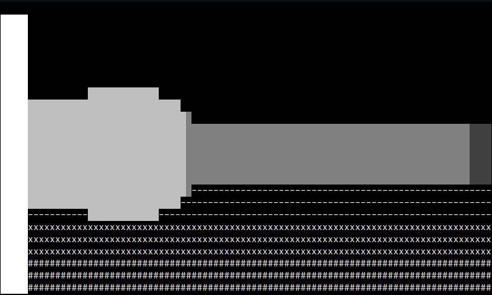
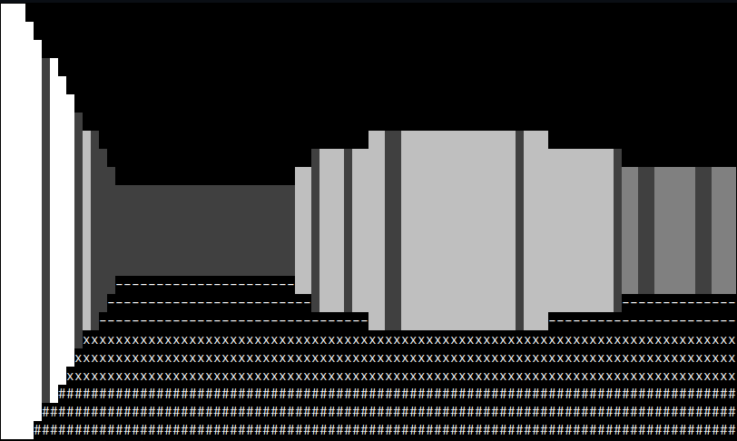
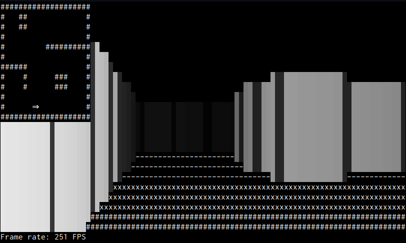

# Raycasting exercise solutions

This set of source files implements possible solutions for the Raycasting exercise.


As usual with programming exercises, there is no such thing as "the solution" -- many options are possible.
These solutions are mine, and opinionated by my experience, taste and style.
Feel free to divert and disagree.

The goal is to learn from this coding exercise, so just consider my approach to the solutions as one of the many options out there.

## Acknowledgements

This idea of a simple ASCII-based "FPS-like" environment in a couple of lines of code is not original.
I took it from [javid9x: "One Lone Coder" on YouTube](http://www.youtube.com/javidx9) who wrote it in C++.
I also used [their code example](https://github.com/OneLoneCoder/CommandLineFPS) as the original inspiration for the 'bare bones version' (i.e. version 01 approximately).

It's just great to see how far you can reach with just a little bit of code, an awesome example of how to have fun coding!

Anyway, many thanks to javid9x, be sure to check out [their website](http://www.onelonecoder.com/).

## How to work with all the code versions?

Your code is probably very different from mine, that's fine.
But this also means you can't just compare your code to mine one-to-one.

Use a diff tool to reveal the difference between each of the versions, and use that difference to check out a possible solution to an exercise step.
Popular diff tools may include `diff`, `meld`, `vimdiff` or perhaps your IDE/editor of choice supports diff views.
I do strongly recommend [`difftastic`](https://github.com/Wilfred/difftastic), which is a diff tool that actually understands language syntax.

For example, to use `vimdiff` to see what's changed between versions 06 and 07:

```sh
vimdiff raycasting_v04.rs raycasting_v05.rs
```

## Version descriptions

Each of the versions incrementally build on the previous one.

### Version 00: Simple terminal application

Create a new project with an executable using:

```sh
cargo new
```

You can now start working in `src/main.rs`.

#### Building and running

Build the executable using:

```sh
cargo build
```

Run it with:

```sh
cargo run
```

#### Naming conventions

This project containing the solution code features multiple executables, or "binary targets" as they are called.
If you want multiple executables in a single project, this can be achieved in several ways:

- Use `src/main.rs` as a binary target,
- Use one or more source files in `src/bin/` that will be binary targets,
- Use custom `[[bin]]` tables in the `Cargo.toml` configuration.

Read more about this in [The Cargo Book](https://doc.rust-lang.org/cargo/reference/cargo-targets.html#binaries).

I chose the naming conventions-based solution simply because it takes the least amount of work.
Hey, I was told good developers are lazy developers!

Screen shot from this version:


### Version 01: Raycasting setup

This version is the previous version including the raycasting setup.

Follow the instructions in the exercise slides to build from the ground up.
The code is pretty straight-forward, it follows an imperative style.

Because we have to mix types, we must use the type cast `as` operation here and there.
In particular, we mix `u16` (the coordinates and dimensions of the map/screen) and `f32` (for any floating-point calculations).

Constant definitions are defined at global scope, which is fine for constants.
Rust style decrees that we use uppercase naming for constants.
The map (for now) is a string literal (i.e. type `&str`) with separate dimension constants.

Screen shot from this version:


### Version 02: Wall and floor shades

This version is the previous version including distance-dependent wall and floor shading.

The matching of a value to a set of ranges is a typical case for use of a `match` expression.
For the wall color for example, the most obvious ways to do this are either using floating-point ranges and `.contains()`, or using a compound expression of a value comparison.

Option 1; floating-point ranges:

```rs
let wall_color = match dist_wall {
    x if (0.0..=(MAX_DEPTH * 0.25)).contains(&x) => "\u{2588}",
    x if ((MAX_DEPTH * 0.25)..=(MAX_DEPTH * 0.5)).contains(&x) => "\u{2593}",
    x if ((MAX_DEPTH * 0.5)..=(MAX_DEPTH * 0.75)).contains(&x) => "\u{2592}",
    x if ((MAX_DEPTH * 0.75)..=MAX_DEPTH).contains(&x) => "\u{2591}",
    _ => " ",
};
```

Option 2; compound expressions of value comparisons:

```rs
let wall_color = match dist_wall {
    x if x > 0.0 && x <= (MAX_DEPTH * 0.25) => "\u{2588}",
    x if x > (MAX_DEPTH * 0.25) && x <= (MAX_DEPTH * 0.5) => "\u{2593}",
    x if x > (MAX_DEPTH * 0.5) && x <= (MAX_DEPTH * 0.75) => "\u{2592}",
    x if x > (MAX_DEPTH * 0.75) && x <= MAX_DEPTH => "\u{2591}",
    _ => " ",
};
```

Pick whatever you like best, they're both fine.
I like the range version more, because it requires less brainpower to understand, despite being slightly noisier than the second option.

Also note how the fact that `match` is an expression leads to the niceness of being able to directly assign to an immutable value `wall_color`.
In other languages like C++ we would have to resort to [IIFE with a lambdas](https://isocpp.github.io/CppCoreGuidelines/CppCoreGuidelines#Res-lambda-init) or separate functions to do this.

The floor color/texture is done in a similar fashion, by normalizing the range values for a fixed distance.

Screen shot from this version:



### Version 03: Moving around

This version is the previous version including input handling to be able to move around.

Use the `code` field from the `event::Event` data structure to parse input key values.
Because `KeyCode` is an enumerator, we can use `if let Event::Key(e) = read()? {}` to directly check and unwrap a key event.

The updating of the player position is pretty straight-forward, in the solution code I introduced a local function to deal with the new position.
In essence, the player position is conditionally updated (as long as no wall collision is detected).
This code assumes that the map definition is "closed" and the player is not able to walk off the edge of the world.

For the player angle we use the [Euclidian remainder calculation `rem_euclid`](https://doc.rust-lang.org/std/primitive.f32.html#method.rem_euclid) to keep the value in the range `0..2π`.

Screen shot from this version:


### Version 04: Refactoring in abstractions

This version is the previous version including a number of refactors / abstractions.

The main goal of the refactor is to cut down the amount of code in the main game loop -- the business logic so to speak.
In the ideal situation the business logic is concise and simple to understand and maintain, the details tucked away in abstractions.
This will add lines of code to the program overall, but will effectively shorten the game loop code.

Each of the following subsections will describe an individual abstraction.

#### 2D position type `Position`

This one is straightforward, we work with 2D positions in multiple places, we might as well build an abstraction for that.
To keep some flexibility, we make it a generic type, taking a type parameter `T` to define the underlying coordinate type.

As usual, we add a `new` method for construction, to prevent having to hand-construct each `Position` instance.
That is, writing:

```rust
let p = Position::new(1.2, 3.4)
```

tends to feel slightly less barbarian than:

```rust
let p = Position { x: 1.2, y: 3.4 };
```

Other than that there are two more things worth mentioning about the `Position` abstraction:

- We add an `adjusted` method to create a new position from an existing one given a delta value for both coordinates (which is used in the player movement methods).
- We add an implementation of the `From` trait to be able to convert a `Position` with underlying type `u16` to one with underlying type `f32`.
- The `is_contained` and `is_wall` methods on `Map` (see next subsection) take input positions as `impl Into<..>`. A call to this function will thus consume the argument value, which is fine because we call all of them with temporary values. This does mean that we must make `Position` `Clone` (by deriving this trait implementation).

#### Level map type `Map`

The level map abstraction `Map` serves two purposes: owning the level map data definition, and facilitating checks for coordinate bounds and wall element positions.

For this abstraction, the constructor is the most interesting part, because it will dynamically derive the level map dimensions from a provided ASCII art definition.
In the solution code the map definition string is assumed to end each line with a newline and a carriage return -- this will be needed for showing the map in the screen in a later version.

The constructor also checks some preconditions that must be fulfilled for the assumptions that are made.
Each of the precondition checks will cause a panic if they fail, which is fine here because we would be dealing with a logic error.

The `is_wall` method tests if a given coordinate in the map is a wall element.
The most straightforward way to implement something like this is to "index" the linearly stored 2D map definition.
But in Rust, a `String` object cannot be indexed just like that, which has to do with the fact that a Rust `String` is UTF-8 data.
And in UTF-8 a single byte may not mean anything sensible per se, it might well be that we're addressing a single byte out of a multibyte Unicode *grapheme clusters*.
So walking over the characters of a string is normally done using iterators.
But we know for sure we're dealing with single-byte ASCII characters here so we can use `as_bytes` and use the indexing operator.

This version stores the level map definition in a `String` inside the `Map` value, this is a run-time, heap-allocating solution.
In a later version, we will investigate if we can make the map definition a compile-time data type.

#### Player state type `Player`

Another obvious abstraction is the `Player` abstraction to own and manage the player state (that is, map position and orientation angle).

The nice thing of having all the state together is that we can also make `Player` the responsible owner of its movement behavior logic.
Especially the position movement modifier methods are interesting here, because they allow the user to inject custom condition checking code.
Passing methods/functions/lambdas to other methods is done via traits `FnOnce`/`FnMut`/`Fn`.
In this case, we expect a predicate that must be able to be called once, expecting a `&Position<f32>` argument and returning a boolean value.
The predicate is called with the to-be-stored new player position, if the predicate returns `true`, the new position will be stored, otherwise it will be ignored.
This setup makes the input handling code at the end of the game loop very simple.

The `Player` type is pretty simple otherwise.

#### Helper functions for distance-to-color conversion

Both functions `distance_to_wall_color` and `distance_to_floor_texture` are `match` expressions wrapped in a function block.
The advantage is that the main business logic only contains the readable/understandable calls to these functions, without having to skip over the internals.

One thing worth mentioning here is that each of these blocks returns a string slice pointing to a single static (Unicode) character.
Because a string slice `&str` is a reference type, we must explicitly mention that it has a `'static` lifetime.

### Version 05: Wall block boundary visualization

This version is the previous version including wall block boundary visualization.
This essentially updates the ray hit calculation code with some extra code to check if the x-coordinate hits a wall block boundary.

The solution code for this version uses an array for storing the dot product results in `corners`.
We could have used a `Vec`, but I think for fixed-size simple cases like this an array is better suited.
Each of the array elements stores a distance from the player to the corner and the dot product result.

A note on the initialization of the `corners` array: this uses the [`array::map` method](https://doc.rust-lang.org/std/primitive.array.html#method.map) introduced in Rust 1.55.
To show you how it works, consider that the following code snippet:

```rust
const OFFSETS: [(u16, u16); 4] = [(0, 0), (0, 1), (1, 0), (1, 1)];

let mut corners = OFFSETS.map(|(tx, ty)| {
    let vx = (xx + tx) as f32 - p.pos.x;
    let vy = (yy + ty) as f32 - p.pos.y;
    let d = (vx * vx + vy * vy).sqrt();
    (d, norm_x * vx / d + norm_y * vy / d)
});
```

leads to the same result as:

```rust
let mut corners: [(f32, f32); 4] = [(0.0, 0.0); 4];

for tx in 0..2 {
    for ty in 0..2 {
        let vx = (xx + tx) as f32 - p.pos.x;
        let vy = (yy + ty) as f32 - p.pos.y;
        let d = (vx * vx + vy * vy).sqrt();
        corners[(ty * 2 + tx) as usize] = (d, (norm_x * vx / d) + norm_y * vy / d);
    }
}
```

Aside from the fact that the top code is more concise, the main difference is that in the bottom code snippet first initializes the mutable array, then loads the dot product values.
However, I'm not entirely sure if the needless initialization of the top code snippet actually survives the whole (surprisingly smart) compilation process at all.

Screen shot from this version:



### Version 06: Mini-map and FPS visualization

This version is the previous version including visualization of the map, player location and frame rate.

In the previous versions, the solution code prepared the level map layout such that each line ends with a '`\n`' (newline) and '`\r`' (carriage return).
In this version the reason for this design choice comes into play as we directly print the mini-map on the screen.
If we use the queueable commands from `crossterm`, we can simply move the cursor to the top left, and print the map.
Newlines and carriage returns will make each level line printing workout nicely.

In order to ergonomically work with visualization of a `Player` and `Map` value, we implement the [`std::fmt::Display`](https://doc.rust-lang.org/std/fmt/trait.Display.html) trait for those types.

The frame rate measurement is implemented using [`std::time`](https://doc.rust-lang.org/std/time/index.html) from the standard library, where we (ex- or implicitly) use [`std::time::Instance`](https://doc.rust-lang.org/std/time/struct.Instant.html) and [`std::time::Duration`](https://doc.rust-lang.org/std/time/struct.Duration.html).

Screen shot from this version:


### Version 07: Wall shades using colors

This version is the previous version including using colors to introduce more wall shades.

Crate `crossterm` supports the simple use of custom RGB colors via `style::Color::Rgb` where we can set each color channel value independently.
The solution code translates the wall distance value to a `u8` value that is used to set R/G/B all at once.

Screen shot from this version:



### Version 08: A compile-time level `Map` value

This version is the previous version including a `const` (static / compile-time) level map definition.

One of the data structures in our program is static, very static.
In fact, it would be nice if we could eliminate all runtime costs associated with its instantiation.
Of course I mean the `Map` level definition.
It's instantiated once, using a string literal, but other than that it's just static data.
Let's see if we can make it a compile-time value!

It turns out we can do it, but it's not pretty.
At the time of writing, many constructs and library functions are not `const` (yet?), or only in unstable toolchains.
Even `const` lambda functions are, no matter how simple they are, are not in stable yet.
This `const`-ification is something that is actively being worked on, so in the future more things will be allowed.

For now, we'll have to make do with C-style imperative code to solve our compile-time problems.

Of course, it must be noted that this whole compile-time effort breaks down when the level map must be read from disk for example.
In a production setting, it probably does not make sense to do this, but it sure makes for a fun experiment!

### Version 09: Reorganizing and documentation

This version is version 07 (the non-`const` `Map`), where we organized the single source file into a library + executable, and added documentation.

Make sure you add (concise) documentation and only expose the needed entities using `pub`.

## Some ideas for extensions

Here are some ideas to further extend the exercise:

- Implement the `Position` type as a proper arithmetic vector type.
- Try another terminal backend, like [termion](https://docs.rs/termion/latest/termion/index.html).
- Read the level map from a file on disk.
- Improve the frame rate (profile the application to find bottlenecks).
- Add other game statistics information such as player position/orientation etc.
- Make the maze resilient to white-on-black as well as black-on-white terminals.
- Add support for window resizing.
- Add support for non-blocking mode, without implementing a busy-loop.
- Have the player start at a position indicated in the level map.
- Add multithreading (for ray calculation, for example).
- Add double buffered screen building and rendering/displaying.
- Add textures on walls, floor or ceiling.
- Add a background image/texture when looking 'outside' of the level (when there are no walls).
- Add movement recording / playback for demo mode.
- Move from ASCII to pixel rendering.
- Add weapons, enemies etc. -- or make a completely different game from it.
